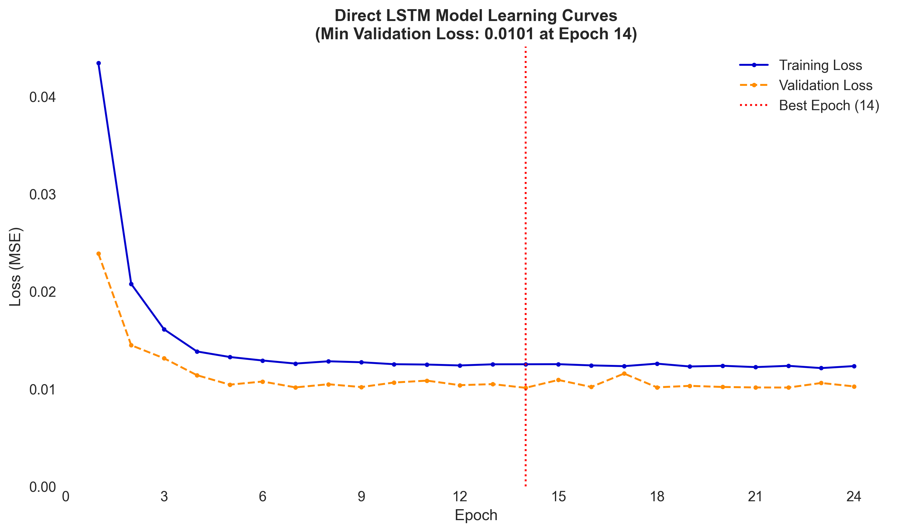
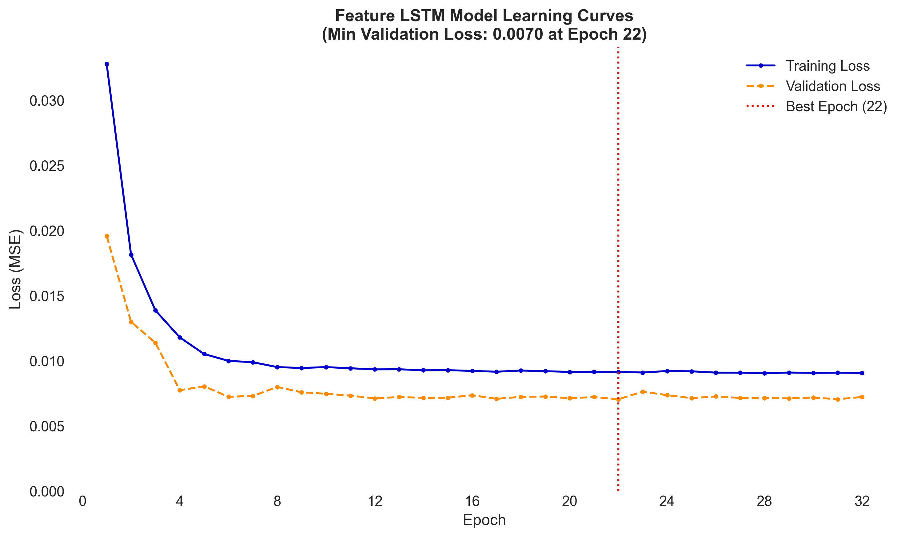
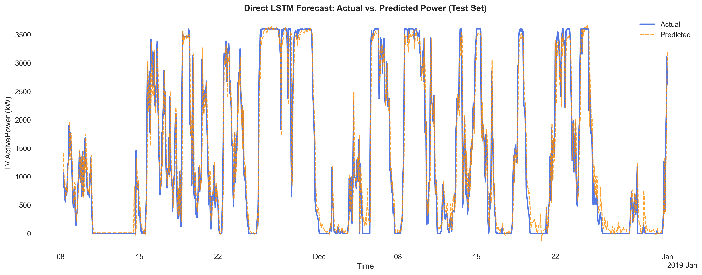
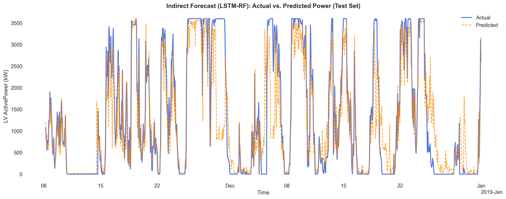

# Wind Power Forecasting with LSTM & Random Forest

This project implements a **hybrid deep learning and machine learning pipeline** to forecast wind turbine power generation using LSTM networks and a two-stage LSTM → Random Forest approach. It emphasizes data preprocessing, scalable modeling, robust evaluation, and automated visualization.

---

## 📁 Project Structure

```
project/
├── main.py                    # Entry point: runs full forecasting pipeline
├── requirements.txt           # Python dependencies
├── README.md                  # Project documentation
├── Dataset/
│   └── wind_turbine_data.csv  # Raw wind turbine dataset
├── src/                       # Source code modules
│   ├── config.py              # Paths, modeling parameters, columns, etc.
│   ├── data_preprocessing.py  # Loading, cleaning, splitting, scaling
│   ├── modeling.py            # LSTM + Random Forest model construction & training
│   ├── evaluation.py          # Performance metrics & scoring
│   ├── plotting.py            # Automated visualizations (EDA, predictions, etc.)
└── results/                   # Auto-generated outputs
    ├── saved_models/          # Best saved LSTM / RF models
    ├── images/                # Plots: distributions, time series, learning curves
    └── metrics_lstm_direct.csv  # Final evaluation metrics
```

---

## 🚀 Features

✅ Two modeling approaches:

- **Direct**: LSTM predicts power directly
- **Indirect**: LSTM predicts features → Random Forest predicts power

✅ Rich EDA and visualization support  
✅ Resampling, scaling, and missing value handling  
✅ Configurable workflow via `src/config.py`  
✅ Evaluation metrics: MAE, RMSE, R², IA, SDE, MAPE  
✅ Modular and production-ready design
✅ Extendable to other time-series datasets with minimal changes

---

## 📊 Dataset

- **Source**: `Dataset/wind_turbine_data.csv`
- **Columns Used**:
    - `LV ActivePower (kW)` — target
    - `Wind Speed (m/s)`
    - `Theoretical_Power_Curve (KWh)`
    - `Wind Direction (°)`
- **Frequency**: Hourly (resampled in pipeline)

---

## ⚙️ Configuration

All settings are managed in `src/config.py`, including:

- Modeling approach (`direct` or `indirect`)
- Train/validation/test split ratios
- LSTM hyperparameters
- Target/feature columns
- Output paths for logs, models, plots, and metrics

---

## 🧪 Running the Project

### 1. Install dependencies

```bash
pip install -r requirements.txt
```

### 2. Choose The Desired Approach
1. Go to `src\config.py`
2. Specify the desired approach
	1. Keep it: `APPROACH = 'direct'
	2. Or change it to: `APPROACH = 'indirect'`
### 3. Run the main pipeline

```bash
python main.py
```

All outputs (trained models, plots, logs, and CSV metrics) will be saved automatically in the `results/` directory.

---

### 📈 Output Examples

#### 🔁 Learning Curves

| Direct LSTM                                                             | Indirect LSTM                                                               |
| ----------------------------------------------------------------------- | --------------------------------------------------------------------------- |
|  |  |
|                                                                         |                                                                             |

#### 📉 Actual vs Predicted (Test Set)

| Direct LSTM                                                                            | Indirect RF                                                                        |
| -------------------------------------------------------------------------------------- | ---------------------------------------------------------------------------------- |
|  |  |

---

### 📊 Test Set Results Comparison

|**Approach**|**MAE**|**RMSE**|**R²**|**IA**|**SDE**|**MAPE**|
|---|--:|--:|--:|--:|--:|--:|
|**Direct LSTM**|231.81|375.24|0.9261|0.9805|374.72|288.02|
|**Indirect (LSTM → RF)**|429.12|720.31|0.7278|0.9170|711.10|1017.82|

> 📌 **Insight**: The Direct LSTM approach outperforms the Indirect method in all evaluation metrics on the test set, particularly in RMSE and MAPE.
